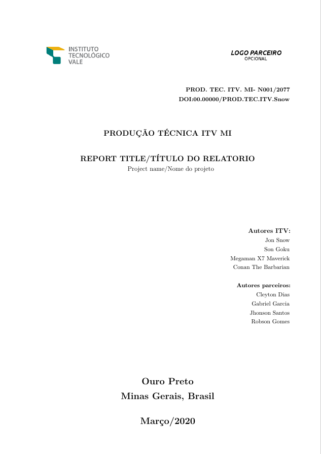

# ITV Latex report template


This report template for the Instituto Tecnologico Vale (ITV) has support for:

  - ABNT references
  - Multilingual (Brazilian portuguese and english)
  - Very flexible, including annexes and acronym list!

# How to use

  - Use the already available www.overleaf.com template
  - Download/clone this repo and use your favorite LaTeX editor!

# Configurations

  - ```\renewcommand{\ITVlocation}{MI}```: ITV localization, it can be DS or MI.
  - ```\prodtecnica```: Technical production number, this is given by the ITV library.
  - ```\titulo```: Document title.
  - ```\tiporelatorio```: type of document. It can be "Final, partial, field, etc".
  - ```\nomeprojeto```: project name.
  - ```\autores```: authors from ITV that participated in the project. The names are separated by a newline or \\.  Ex: Author 1\\Author 2\\Author 3.
  - ```\newcommand{\autoresexternos}```: authors from the external partnership. As the previous command, every author is separated by newline or \\. This command is optional and can be disabled by commenting the declaration.
  - ```\local```: Local of the document, generally it must be "Ouro Preto\\Minas Gerais, Brasil" for ITV MI.
  - ```\data```: Date of the document, in month/year format.
  - ```\parceirologo```: Partner logo, this is optional and can be disabled by commenting the command.
    
## Screenshot



# Development

Want to contribute? Great! pull request are welcome!

## Future work

  - Cleaner parameter setup
  - Better way for internationalization
    
License
----

MIT